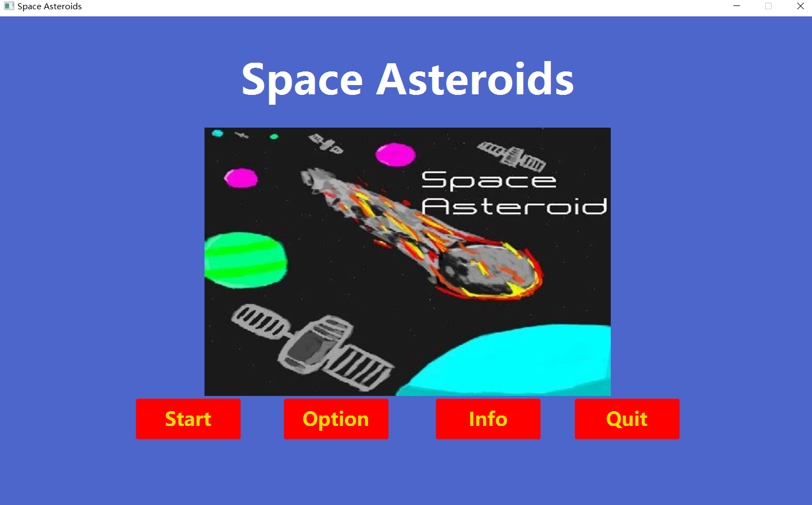
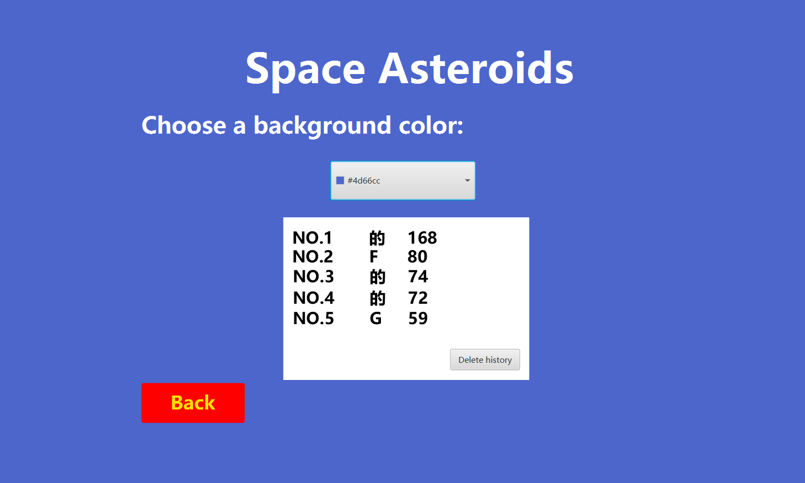
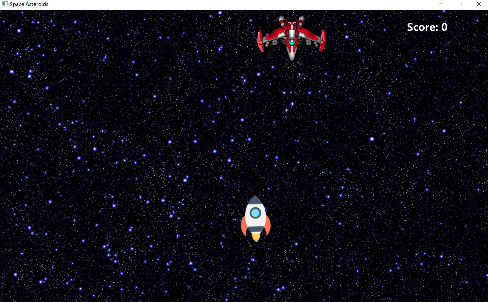
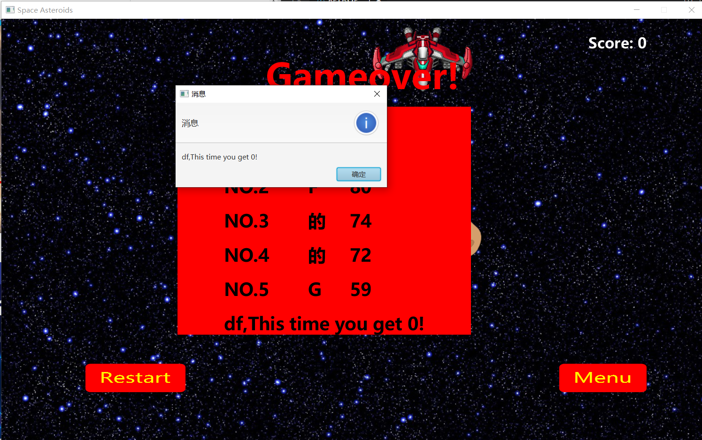

## Development environment
This game is a computer game, the development language is java, jdk 16, testing environment for Windows system.

## Design pattern
- Singleton pattern: we use it to create a boss.This class provides a way to access its unique object, directly, without the need to instantiate an object of that class.
- Strategy pattern: we use it to create asteroid class. These class have different speed. we create speedBehavior for every asteriod to choose their own speed.
- Factory Pattern: we use it to create imgs and sounds.we define an interface to create an object, and let its subclass decide which factory class to instantiate; the factory pattern delays its creation until the subclass does.
- Template method pattern: we use it to create props.An abstract class props publicly defines a way/template to execute its methods. Its subclasses fireprops override method implementations as needed and calls will be made in the way defined in the abstract class props.
- Memento Pattern: we use it to store color and data.To hold a state of an object so that the object can be restored at the appropriate time.

 ## Effect display
Start screen

Option screen

Game screen

Game finishing screen

